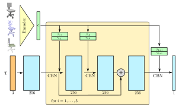
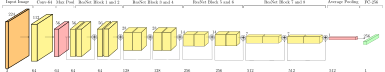
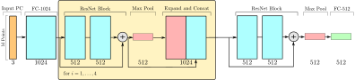
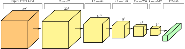

Introduction
============

Presentation
------------

Click [here](slides_no_copyright/index.html) to see it in your browser - Firefox is recommended.

Click [here](slides_no_copyright/slides.pdf) for the PDF version.


Abstract Definition
-------------------

The problem of representing 3D structures is harder than its 2D counterpart. Good solutions for it are specially important for learning-based algorithms, since bad representations usually yield unreasonable large memory requirements, glaring inconsistencies or other difficulties.

An *Occupancy Network* is a state-of-the-art solution that uses implicit functions (neural networks with parameters $\theta$) to represent 3D objects in a compact and expressive manner. Bellow we have its formal definition.

**Definition (Occupancy Network)** For a given input $x \in X$, we want a binary classification neural network: $f^x_\theta : \mathbb{R}^3 \to [0,1]$. We can just add $x$ to the inputs, ie, 

$$f_\theta : \mathbb{R}^3 \times X \to [0,1].$$

$f_\theta$ is called the *Occupancy Network*.


Other Representations
=====================

A more detailed (and visual) comparison can be found in the presentation. To avoid redundancy, we'll present a brief synthesis with the main takeaways.


Voxels
--------

Pros

* Simple to use;

Cons

* Doesn't quite work in low resolutions;
* Requires a lot of memory;


Point clouds
--------------

Pros

* Simple to use and behaves well under geometric transformations;
* Doesn't require a lot of memory; 

Cons

* Hard to extract the underlying geometry;


Meshes
--------

Pros

* Simple to use and behaves well under geometric transformations;
* Doesn't require a lot of memory;

Cons

* Topology limitations or consistency problems - depending on the approach;


The Devil is in The Details
===========================

Using the abstract definition, the authors presented solutions for 4 different problems. In order to set apart the common definitions from the specificities of each problem, this section is divided in 5 subsections.

Besides the expected lack of complete coverage of all implementation nuances, a few inconsistencies were found in the article and in the supplementary material. The source code was an important settler for the questions that arouse during my readings, so we'll adopt the following typographical convention:

(see `path_to_a_file`) refers to a file in [https://github.com/autonomousvision/occupancy_networks](https://github.com/autonomousvision/occupancy_networks)


Common
--------

### ONet Architecture - The Big Picture

In all experiments, the same base architecture was employed: 

{width=80%}

**Input** The output of a task-specific encoder $c \in X = \mathbb{R}^C$ and a batch of $T$ points $p_i \in \mathbb{R}^3$.

**Output** To be consistent with our previous definition, the output is given by the numbers $$f_{\theta}(c, p_1),\, \cdots,\, f_{\theta}(c, p_T) \in [0,1].$$ In other words, for each point $p_i$ in the batch, we get a number in $[0, 1]$.

**Evaluation** To show how the architecture works we'll first explain the *Big Picture* - how the components are connected - and afterwards tell exactly what each component does.

For each point $p_i \in \mathbb{R}^3$ in the batch:

1. Use a fully-connected layer to produce a 256-dim feature vector from $p_i$;
2. Do 5 times:
	- Take the output from the previous step and use a **ONet ResNet-block** to produce a new 256-dim feature vector;
3. Take the output from the last **ONet ResNet-block** and pass through a **CBN layer** and a **ReLu activation**;
4. Pass the result through a fully-connected layer to project the features down to 1-dim;
5. Use a **Sigmoid activation** to obtain a number in $[0,1]$;

**Observation** In the ONet article, they originally used the nomenclature *ResNet-blocks*. Since there're different kinds of *ResNet-blocks*, I've added specification tokens to avoid unnecessary confusion.


### Activation Functions 

**ReLU** From the source code (see `im2mesh/layers.py`), it's clear that the standard PyTorch's ReLU was used. For both the current stable version (1.3.1) and the version used in the project (1.0.0), it is defined as

$$ 
\mathrm{ReLU}(x)
= 
\max\{0, x\}.
$$

**Sigmoid** The sigmoid function is actually implemented in the mesh extraction phase (see `im2mesh/onet/generation.py - line 171`), by applying the inverse function to the threshold:

`threshold = np.log(self.threshold) - np.log(1. - self.threshold)`

By inverting the threshold function again, we can recoup the information:

$$\mathrm{Sigmoid}(x) = \frac{1}{1 + e^{-x}}.$$

This is known as the *logistic sigmoid*.


### Conditional Batch Normalization (CBN) Layer

Let $(p_i)_{i=[1:T]}$ be the vector of the input points, as shown in Figure 1. With this indexation in mind, let us define a CBN layer [1]:

**Input** 

1. $c$, which is the output from the task-specific encoder;
2. The output from the last layer: $\left(f_{in}^i\right)_{i \in [1:T]}$,
	in which $f_{in}^i \in \mathbb{R}^{256}$;

**Output** A vector $\left(f_{out}^i\right)_{i \in [1:T]}$, with $f_{out}^i \in \mathbb{R}^{256}$.

**Evaluation** Compute the first two moments of $\left(f_{in}^i\right)_{i \in [1:T]}$ over all $i\in[1:T]$:

$$ \mu = \mathrm{E}\left[f_{in}^i\right] \text{ and}$$

$$ \sigma^2 = \mathrm{Var}\left[f_{in}^i\right];$$

then use two fully-connected layers to obtain 256-dim vectors $\beta(c)$ and $\gamma(c)$ to evaluate the final output 

$$f_{out}^i = \gamma(c) \frac{f_{in}^i - \mu}{\sqrt{\sigma^2 + \epsilon}} + \beta(c),$$

in which $\epsilon = 10^{-5}$ is a constant added for numerical stability.

Since the sum between scalars and vectors is already implicitly defined in the denominator, it's important to highlight (as in the original article [1]) that the multiplication by $\gamma$ is a *piecewise* (not inner) product.

**Observation** The PyTorch's class `BatchNorm1d` [2], used to compute $\frac{f_{in}^i - \mu}{\sqrt{\sigma^2 + \epsilon}}$ (see `im2mesh/layers.py`), keeps a running mean of the first two moments. These estimates are then used for normalization during evaluation.

[1] [Batch Normalization: Accelerating Deep Network Training by Reducing Internal Covariate Shift](https://arxiv.org/abs/1502.03167) - Sergey Ioffe, Christian Szegedy (2015)

[2] [torch.nn.modules.batchnorm](https://pytorch.org/docs/stable/nn.html#batchnorm1d)


### ONet ResNet-block

We'll now describe a single ONet ResNet-block (see `im2mesh/layers.py - class CResnetBlockConv1d`) as the composition of previously defined components, in the order of application:

1. CBN layer;
2. ReLU activation function in each dimension;
3. Fully-connected layer;
4. CBN layer;
5. ReLU activation function in each dimension;
6. Fully-connected layer;

To get the output of the ONet ResNet-block, we then sum the input of step 1 to the output of step 6.


### Pre-processing Shapes

**Definition (Occupancy function)** Given a solid shape $S \subset \mathbb{R}^3$, the *occupancy function* $o : \mathbb{R}^3 \to \{0, 1\}$ is defined as
$$
	o(p)
=
	\begin{cases}
		0 && \text{if } p\notin S \\
		1 && \text{if } p\in S \\
	\end{cases}.
$$
in other words, the *occupancy function* is the characteristic function for the set of the solid shape.

All 4 experiments used the ShapeNet [?] database for training, which is a dataset composed of annotated CAD meshes. To extract the data from each of the shapes, the following procedure was used:

1. Make sure the mesh is watertight with code provided by Stutz et al. [?];
2. Normalize the shape such that its bounding box is centered at the origin and that the biggest side of the bounding box measures exactly 1;
3. Using an uniform random distribution, sample 100k points from the new bounding box with 0.05 padding on the sides;
4. Choose (with repetition) $K=2048$ points;
5. For each of the $K$ chosen points, compute $o_i = o(p_i)$ and store both $(p_i)_{i \in [1:K]}$ and $(o_i)_{i\in [1:K]}$ in a file;

**Observation** Contradicting the supplementary material, the source code defines $K=1024$ (step 4) for the voxel super resolution experiment (see `configs/voxels/onet.yaml` and `configs/voxels/onet_pretrained.yaml`).

[?] [ShapeNet: An Information-Rich 3D Model Repository](https://arxiv.org/abs/1512.03012) - A. X. Chang et al. (2015)


### Training And The Loss Function

With the exception of unsupervised mesh generation - which will be explained later - the same loss function was adopted in all experiments:

**Definition (Mini-batch loss function)** Let $\mathcal{B}$ be a subset of 64 (see `configs/*/onet.yaml`) preprocessed shapes from ShapeNet. The *mini-batch loss function* is defined as
 
$$
	\mathcal{L}_{\mathcal{B}}(\theta) 
= 
	\frac{1}{|\mathcal{B}|}  \sum_{i=1}^{|\mathcal{B}|} 
		\sum_{j=1}^ K \mathcal{L}\left(f_\theta(p_{ij},c_i), o_{ij}\right),
$$

in which $c_i$ is the output from the task-specific encoder for the $i$th shape and $\mathcal{L}$ is a cross-entropy classification loss. This function isn't explicitly defined in the article nor in the supplementary material, which is not a problem for an open source project. These are the 4 relevant lines (see `im2mesh/onet/training.py`)

```
168:        logits = self.model.decode(p, z, c, **kwargs).logits
169:        loss_i = F.binary_cross_entropy_with_logits(
170:            logits, occ, reduction='none')
171:        loss = loss + loss_i.sum(-1).mean()
```

`logits` is the tensor $f_\theta(p_{ij},c_i)$ without the *logistic sigmoid* and `occ` is the tensor of the ground true occupancies $o_{ij}$. [`binary_cross_entropy_with_logits`](https://pytorch.org/docs/stable/nn.functional.html#binary-cross-entropy-with-logits) is a PyTorch's function that computes the following tensor:

$$
	l(x, y) = L = \{l_1, \cdots, l_N\}^T
$$

in which

$$
	l_n = - \Big[ y_n \log \big(\mathrm{Sigmoid}(x_n)\big) + (1-y_n) \log\big(1-\mathrm{Sigmoid}(x_n)\big)\Big].
$$

In other words, it's a numerically more stable version of the composition of the logistic sigmoid and a binary cross entropy function. Translating this to our naming conventions yields

$$
	\mathcal{L}\left(f_\theta(p_{ij},c_i), o_{ij}\right) 
:=
	-\Big[ o_{ij} \log \big(f_\theta(p_{ij},c_i)\big) + (1-o_{ij}) \log\big(1-f_\theta(p_{ij},c_i)\big)\Big].
$$

Since $o_{ij} \in \{0, 1\}$, we can also write $\mathcal{L}$ in the following way:

$$
	\mathcal{L}\left(f_\theta(p_{ij},c_i), o_{ij}\right)
=
	-
	\begin{cases}
		\log \big(f_\theta(p_{ij},c_i)\big) && \text{if } o_{ij} = 1 \\
		\log\big(1-f_\theta(p_{ij},c_i)\big) && \text{if } o_{ij} = 0
	\end{cases}.
$$
Note that the enhanced numerical stability of [`binary_cross_entropy_with_logits`](https://pytorch.org/docs/stable/nn.functional.html#binary-cross-entropy-with-logits) over the naive composition also explains why the *logistic sigmoid* isn't embedded in the architecture itself.

$\blacksquare$

The *mini-batch gradient descent* is a variation of the standard gradient descent. Instead of computing the partial derivatives of the loss function using the entire set of shapes each time, the database is divided in batches or partitions. Then, for each partition, we just approximate the true gradient and update the neural network parameters $\theta$ accordingly. This process is repeated until a stop criteria is triggered.

**Observation** For all ONet experiments, the stop criteria is based on the IoU metric.

To compute the gradient approximations and update the parameters, Adam optimizer [?] was used with a learning rate of $\eta=10^{-4}$ and no weight decay. The default PyTorch's values for the other hyperparameters were left untouched: $\beta_1=.9$, $\beta_2=.999$ and $\epsilon=10^{-8}$.

[?] [Adam: A Method for Stochastic Optimization](https://arxiv.org/abs/1412.6980),  Diederik P. Kingma, Jimmy Ba (2014)

[?] [Learning 3D Shape Completion under Weak Supervision](https://arxiv.org/abs/1805.07290), Stutz et al. (2018)


Single View Image Reconstruction
----------------------------------

Before talking about the encoder, we need the definition bellow.

**Definition (ImageNet normalization)** Let $x \in [0,1]^{w \times h \times 3}$ be a colored image, $\mathrm{\mu_{ImN}} :=(	.485,\, .456,\,	.406)$ and $\mathrm{\sigma_{ImN}}:= (.229,\, .224, \,	.225)$. Then the *normalized* image is then given by 

$$
\hat{x}_{ij} = \frac{x_{ij} - \mu_{ImN}}{\sigma_{ImN}},
$$
in which the division is piecewise.

$\blacksquare$

### The Image Encoder

{width=100%}

**Input** $224 \times 224$ image, normalized according to ImageNet standards. 

**Output** A feature vector $c \in \mathbb{R}^C$, for $C=256$.

**Evaluation** The only difference between ResNet18 [3] and the neural network used as the encoder is the last fully connected layer. Instead of producing a 512-dim output, the last layer projects it down to a 256-dim vector $c$. The encoder was pre-trained on the ImageNet dataset.

[3] [Deep Residual Learning for Image Recognition](https://arxiv.org/abs/1512.03385), Kaiming He et al. (2015)

The reference above is a landmark of sorts for its area - hence the large number of citations. They introduced the idea of using residues to make deep neural networks viable.

One eye-catching piece of information is that the authors of ONet (see `im2mesh/encoder/conv.py`) did implement several sizes of ResNets: 18, 34, 50 and 101.  Since this particular encoder was pre-trained, it raises the question of why ResNet18 worked better than its deeper counterparts.  


Point Cloud Completion
------------------------

{width=100%}

**Input** M=300 points generated from a watertight mesh taken from ShapeNet in the following manner:

1. Make sure the mesh is watertight with code provided by Stutz et al. [?];
2. Normalize the shape such that its bounding box is centered at the origin and that the biggest side of the bounding box measures exactly 1;
3. Sample 300 points from the *surface* of the model;
4. Apply noise to the points using a Gaussian distribution with zero mean and standard deviation of 0.05 (see `im2mesh/data/transforms.py`);

**Output** A feature vector $c \in \mathbb{R}^{C}$, for $C=512$.

**Description** The network consists of 2 fully connected layers (for input and output) and 5 *PointNet ResNet-blocks* intercalated by pooling+expansion layers, as shown in Figure 3.

**Note** In the supplementary there's no distinction between *PointNet ResNet-blocks* and ONet ones. In the source code they're completely different (see `im2mesh/layers.py` and `./im2mesh/encoder/pointnet.py`).

We can find a legacy definition of the ONet architecture, and in this version both used the same simplified ResNet-block defined bellow. This might explain the inaccuracies in the PDFs. Without further ado, let us present the definition from the source code:

**Definition (PointNet ResNet-block)** The class used to represent the *PointNet ResNet-blocks* is the following (see `im2mesh/layers.py` and `./im2mesh/encoder/pointnet.py`):

```
# Resnet Blocks
class ResnetBlockFC(nn.Module):
    ''' Fully connected ResNet Block class.

    Args:
        size_in (int): input dimension
        size_out (int): output dimension
        size_h (int): hidden dimension
    '''
```

For *PointNet ResNet-blocks*: `size_in=1024`, `size_out=512` and `size_h=512`. Therefore one block is defined as the following composition, in order of application:

1. Fully connected NN - 1024-dim to 512-dim;
2. Fully connected NN - 512-dim to 512-dim;
3. ReLU activation layer;

Since the input and output dimensions differ, we have an additional FCNN projecting the input for step 1 (1024-dim) to $x_s$ (512-dim). Hence the final output is the sum of the output from step 3 and $x_s$.

$\blacksquare$


Voxel Super Resolution
----------------------



**Input** A grid of $32^3$ voxels. More specifically, voxels generated from (watertight) ShapeNet meshes with the algorithm bellow: 

1. Normalize and make the shape watertight using the methods described previously;
2. Mark all voxels that intercept the model's surface as occupied;
3. For each of the remaining voxels:
	- Choose 1 random point inside the voxel;
	- If the point lies inside the mesh mark the corresponding voxel as occupied;

**Output** A feature vector $c \in \mathbb{R}^C$, for $C=256$.

**Evaluation** The input passes trough 5 3D convolution layers, and a fully connected layer to project the output to the space $\mathbb{R}^{256}$. All convolution layers use *zero-padding* with size 1 and $3\times 3\times 3$ filters (see `im2mesh/encoder/voxels.py`). Stride is implicitly defined in Fig [4].


Unconditional Mesh Generation
-------------------------------

We'll talk about the implementation before long, but before that I'd like to present a general idea of the process to the reader. Although the authors did use the word *unsupervised* in the article, it wasn't the most descriptive choice - let me explain why:

Suppose that we want to generate shapes in the category *car*, we would proceed as follows: 

1. Take the annotated meshes from ShapeNet and extract the subset of shapes that correspond to our chosen category;
2. Train a Variational Autoencoder using this subset;
3. Sample the latent space and use the decoder to generate new shapes;

A more appropriate label would be *semi-supervised*, since we're both using the labels extract subsets in a *supervised* fashion and learning about the distributions of these subsets in an *unsupervised* manner.


###  The Encoder

Preceding the low level definition, it's a good idea to keep in mind a high level model of what we're trying to achieve. The busy reader skip this section by jumping directly to the definition of *encoder latent*.

Traditional learning-based autoencoders are usually defined as two neural networks:

$$
	E_\psi: X \to Z
$$

$$
	D_\theta: Z \to X
$$

One called the encoder, that takes the input $x \in X$ and maps it to a smaller dimensional latent space $Z$; and another called decoder, that performs the inverse, ie, that tries to reconstruct the original input from a point in  $Z$.

Given a set o inputs $B = \{x_1, \cdots ,x_N\} \in X$, we can define a loss function

$$
	\mathcal{L}_B(\theta, \psi) 
= 
	\frac{1}{N} \sum_{i=1}^N 
	\Big[
		\mathcal{L}\big(D_\theta(E_\psi(x_i)), x_i\big)
	\Big],
$$

that just compares each input $x_i$ to its encoded and decoded counterpart $\tilde x_i = D_\theta(E_\psi(x_i))$. Using $\mathcal{L}$, we can just train the two neural networks to optimize the compression, which is an *unsupervised* training scheme because no labeling is required for the inputs $B$.

To generate new plausible entries for the input space $X$, a naive approach would be to simply take random points $z \in Z$ or in an open cover $\tilde Z \subset Z$ for $E_\psi(B)$ and store $D_\theta(z)$ for those random points. Unfortunately this doesn't work for traditional learn-based autoencoders because $D_\theta$, in general, isn't a stable function, ie, 

$$
	\newcommand{\notimplies}{\;\not\!\!\!\implies}
	\big| z - E_\psi(x_i) \big|\text{ is small} \notimplies \mathcal{L}(D_\theta(z), x_i) \text{ is small}.
$$

To solve this problem and regularize the latent space, we can modify our encoder to produce a probability distribution. Instead of mapping $x0 \in X$ to a single point $z0 \in Z$ as a traditional encoder, a variational encoder does the following

$$
	g_\psi(x0) = q_\psi(z | x0) \in P(Z),
$$

in which $P(Z)$ is the space of probability measures on $Z$. To use this new encoder, we can define a new loss function:

$$
	\mathcal{L}'_B(\theta, \psi) 
= 
	\frac{1}{N} \sum_{i=1}^N 
	\Big[
		 \mathcal{L}\big(D_\theta(\tilde z_i), x_i\big)
		 +
		\mathcal{L}_P\big(q_\psi(x_i), \mathcal{N}(0,1)\big)
	\Big],
$$

in which

$$
	\tilde z_i\text{ is a single random sample from } g_\psi(x_i)
$$

$$
	\mathcal{L}_P \text{ is a loss function for two probabilities in }P(Z)
$$

Naturally, one can tweak the stochastic loss function $\mathcal{L}'_B$ by using different sampling schemes or different arguments for $\mathcal{L}_P$, but this example encapsulates the basic idea of a *variational autoencoder* - VAC for short.

**Definition (Variational encoder)** Let $p_i \in \mathbb{R}^3$ be a sequence of $K$ positions in 3D space and $o_i \in \{0, 1\}$ be their corresponding ground truth *occupancies*. The encoder

$$
	g_\psi : (p, o) \mapsto (\mu_\psi, \sigma_\psi)
$$

takes the points and their occupancies and maps them to values in $\mathbb{R}^L$ that represent respectively the average and the standard deviation of a Gaussian distribution $q_\psi(z |(p_i, p_i)_{i=1:K})$ in the latent space $\mathbb{R}^L$.

$blacksquare$

**Definition (Variational loss function)** The loss function is given by:

$$
	\mathcal{L}^{\text{gen}}_{\mathcal{B}}(\theta, \psi) 
= 
	\frac{1}{|\mathcal{B}|}  \sum_{i=1}^{|\mathcal{B}|} 
	\left[
		\sum_{j=1}^ K \mathcal{L}\left(f_\theta(p_{ij},z_i), o_{ij}\right)
		+ \mathrm{KL} \left(q_\psi(\tilde z | (p_{ij}, o_{ij})_{j=1:K}) \,\|\, \mathcal{N}(0,1) \right)
	\right]
$$

in which $\mathrm{KL}$ denotes the KL-divergence  and $\tilde z_i \in Z$ is a single random sample from the probability distribution given by the encoder: $q_\psi(z_i | (p_{ij}, o_{ij})_{j=1:K})$.

More info about the KL-divergence and its interpretations can be found [here](https://en.wikipedia.org/wiki/Kullback-Leibler_divergence). For us, the important thing is that it's a loss function between probability distributions whose formula (in our specific case) simplifies to

$$
\mathrm{KL} \left(q_\psi(\tilde z | (p_{ij}, o_{ij})_{j=1:K}) \,\|\, \mathcal{N}(0,1) \right)
=
	\frac{1}{2}
	\sum_{i=1}^L
	\left(
		\sigma_i^2 + \mu_i^2 - \ln(\sigma_i^2)-1)
	\right)
$$

[?]

$\blacksquare$
