

# Occupancy Networks 

Rodrigo Loro Schuller

28 November 2019

---

# Introduction

* Rise in learning-based 3D reconstruction (2015-2016);

* The problem of 3D representation:

	- State-of-the-art alternatives;

	- Occupancy network;

* Results and comparisons;

* Failure cases and further work;

---

# The problem of 3D representation

* Harder than 2D - no agreed upon standards;

* State-of-the-art alternatives:

	- Voxels;

	- Point clouds;

	- Meshes;

* Occupancy networks;

---

# Voxels 

## The good, the bad and the ugly

---

## Voxels - The good

* Natural extension to pixels;

* Simple:

	- We have marching cubes for mesh construction;

	- Works well on GPU;
---

## Voxels - Similarity operations (the bad) 

**Definition (Similarity)** A *similarity transformation* is an affine transformation $x \mapsto Ax + b$ in which $A = \alpha Q$ for any orthogonal matrix Q.

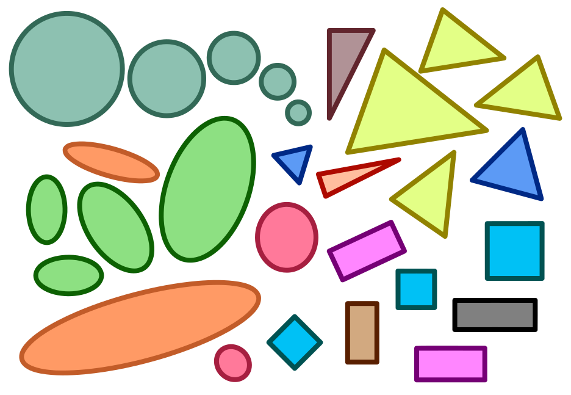

* Low resolution voxel-based representations don't behave well under ST!

---

## Voxels - Similarity operations (the bad) 

Let $T^X_\lambda$ be a group of transformations in the space $X$, with correspondents $T^Y_\lambda$ in the space $Y$.

**Definition (Equivariance)** A function $\phi : X \to Y$ is *equivariant* under the group $T$ if $\forall \lambda \in \Lambda,\, \forall x \in X, \, \phi\left(T^X_\lambda x\right) = T^Y_\lambda \phi(x)$.

---

## Voxels - Similarity operations (the bad) 

Let $T^X_\lambda$ be a group of transformations in the space $X$, with correspondents $T^Y_\lambda$ in the space $Y$.

**Definition (Equivariance)** A function $\phi : X \to Y$ is *equivariant* under the group $T$ if $\forall \lambda \in \Lambda,\, \forall x \in X, \, \phi\left(T^X_\lambda x\right) = T^Y_\lambda \phi(x)$.

**Definition (Invariance)** $\forall \lambda \in \Lambda,\, \forall x \in X, \, \phi\left(T^X_\lambda x\right) = \phi(x)$.

---

## Voxels - Similarity operations (the bad) 

Let $T^X_\lambda$ be a group of transformations in the space $X$, with correspondents $T^Y_\lambda$ in the space $Y$.

**Definition (Equivariance)** A function $\phi : X \to Y$ is *equivariant* under the group $T$ if $\forall \lambda \in \Lambda,\, \forall x \in X, \, \phi\left(T^X_\lambda x\right) = T^Y_\lambda \phi(x)$.

**Definition (Invariance)** $\forall \lambda \in \Lambda,\, \forall x \in X, \, \phi\left(T^X_\lambda x\right) = \phi(x)$.

**Observation** Standard CNNs are equivariant to discrete translations!

---

## Voxels - Similarity operations (the bad) 

We can make 2D CNNs equivariant to $\mathbb{Z}_4$:

 

---

## Voxels - Similarity operations (the bad) 

We can make 2D CNNs equivariant to $\mathbb{Z}_4$:

 

And to other rotations!

---

## Voxels - Similarity operations (the bad) 

In 3D we have equivariance under $S_4$:

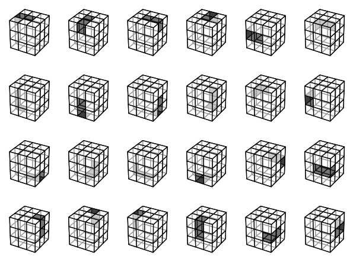

<small>[1] CubeNet: Equiv. to 3D R. and Translation, D. Worrial and G. Brostow (2018)</small>

---

## Voxels - Memory complexity (the ugly)

* The elephant in the room is the $\Theta(n^3)$ complexity!

* But we can make it better;

---

## Voxels - Memory complexity (the ugly)

Activation profile for different pooling layers in ConvNet

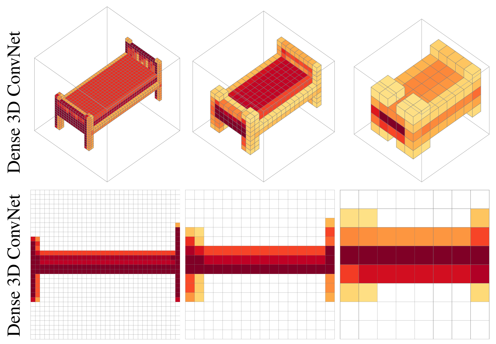

---

## Voxels - Memory complexity (the ugly)

Activation profile for different pooling layers in ConvNet

Let's try octrees!

---

## Voxels - Memory complexity (the ugly)

### Octree - Adaptative data structure

  
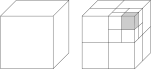

---

## Voxels - Memory complexity (the ugly)

<small>[2] OctNet Learning 3D Repr. at High Resolutions, G. Riegler (2017)</small>

---

## Voxels - Memory complexity (the ugly)

Most state-of-the art voxel-based RNN use $32^3$ or $64^3$ voxels. 

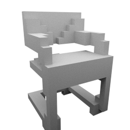

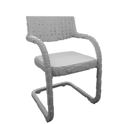

<b>Figure</b>: comparison between resolutions, from 16 to 128.

---

## Voxels - Memory complexity (the ugly)

Most state-of-the art voxel-based RNN use $32^3$ or $64^3$ voxels. 

<b>Figure</b>: comparison between resolutions, from 16 to 128.

**Observation** 3D-R2N2 (Choy, 2016) uses $32^3$.

---

## Point clouds as 3D representations 

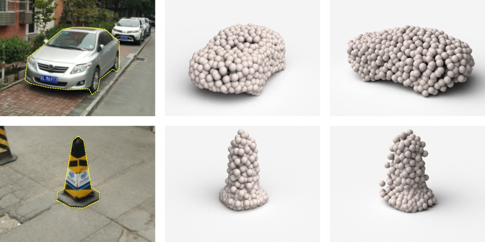

<b>Figure</b>: Reconstructed 3D point clouds (H. Fan, 2016) and a torus.

---

## Point clouds as 3D representations

* Behave well under similarity and other geometric transformations;

* More efficient than voxels - adaptative;

* Produce nice 3D models in NNs:

	- Architecture divided in two parts to account for large and smooth surfaces;

	- Good for segmentation analysis;

* Extracting meshes is complicated;

---

## Generation network using point clouds

 

  

**Observation** Local and global specializations. Sounds familiar?

<small>[3] A Point Set G. N. for 3D Object Reconst. from a Single Image,  H. Fan (2016) </small>

<!--
---

## Hemisphere specialization - After stroke
 

<small> [4] H. specialization of memory for visual hierarchical stimuli, D. C. Delis (1986) </small>

-->

---

## H. specialization - Split-brain patient
 

<small> [5] Unknown source, taken from J. Gabrieli's lecture slides</small>

---

## H. specialization - Anatomy of the brain 

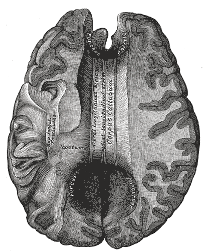

<b>Figure</b> Drawing of <i>corpus callosum</i>, connecting the local (LH) and the global (RH).

---

# Meshes for 3D reconstruction

## Good in theory

---

# Meshes for 3D reconstruction

## Main takeaways 

* Behave well with geometric transformations;

* Small memory footprint and fast operations;

* But hard to use in practice:

	- Intersections/overlaps or non-closed geometry;

	- Topology limitations;

---

## Meshes for 3D reconstruction - AtlasNet 

 
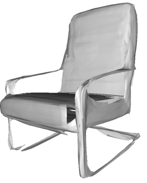
 

<small>[6] AtlasNet: A Papier-Mâché Approach to L. 3D Surface G., T. Groueix (2018)</small>

---

## Meshes for 3D reconstruction - Pixel2Mesh

 

 

<small>[7] Pixel2Mesh: Generating 3D Mesh Models from S. RGB Images, N. Wang (2018)</small>

---

# Occupancy Network

## Learning 3D Reconstruction in Function Space

Mescheder, Lars and Oechsle, Michael and Niemeyer, Michael and Nowozin, Sebastian and Geiger, Andreas 

2019

---

## Occupancy Network

Ideally, we would like to know the *occupancy function*

$o : \mathbb{R}^3 \to \{0, 1\}$

---

## Occupancy Network 

Ideally, we would like to know the *occupancy function*

$o : \mathbb{R}^3 \to \{0, 1\}$

**Key idea** Approximate with a continuous function!

---

## Occupancy Network

**Definition** For a given input $x \in X$, we want a binary classification neural network: $f^x : \mathbb{R}^3 \to [0, 1]$.

---

## Occupancy Network

**Definition** For a given input $x \in X$, we want a binary classification neural network: $f^x : \mathbb{R}^3 \to [0, 1]$. But we can just add $x$ to the inputs, ie,

$f_\theta : \mathbb{R}^3 \times X \to [0, 1].$

We call $f_\theta$ the *Occupancy Network*.

---

## Occupancy Network 

**Definition** For a given input $x \in X$, we want a binary classification neural network: $f^x : \mathbb{R}^3 \to [0, 1]$. But we can just add $x$ to the inputs, ie,

$f_\theta : \mathbb{R}^3 \times X \to [0, 1].$

We call $f_\theta$ the *Occupancy Network*.

**Observation** The approximated 3D surface, for a particular $x_0$, is given by S = $\{p \in \mathbb{R}^3\,|\,f_\theta(p, x_0) = \tau \}$;

---

## Occupancy Network 
### Representation capabilities

<b>Figure</b>: 32 to 128 voxels vs <i>Occupancy Network</i>.

---

## Occupancy Network 

### Representation capabilities 

 

---

## Occupancy Network - Training

1. Randomly sample points in the 3D bounding volume of the object - with padding;

---

## Occupancy Network - Training

1. Randomly sample points in the 3D bounding volume of the object - with padding;

2. Evaluate the mini-batch loss

$
\newcommand{\cB}{\mathcal{B}}
\newcommand{\cL}{\mathcal{L}}
\cL_{\cB}(\theta)
= \frac{1}{|\cB|}\sum_{i=1}^{|\cB|} \sum_{j=1}^ K \cL(f_\theta(p_{ij},x_i), o_{ij})
$

in which $\mathcal{L}$ is a cross-entropy classification loss.

---

## Occupancy Network - Training

1. Randomly sample points in the 3D bounding volume of the object - with padding;

2. Evaluate the mini-batch loss

$
\newcommand{\cB}{\mathcal{B}}
\newcommand{\cL}{\mathcal{L}}
\cL_{\cB}(\theta)
= \frac{1}{|\cB|}\sum_{i=1}^{|\cB|} \sum_{j=1}^ K \cL(f_\theta(p_{ij},x_i), o_{ij})
$

in which $\mathcal{L}$ is a cross-entropy classification loss.

**Observation** Different sampling schemes were tested, random in the BB w/ padding worked best.

---

## Occupancy Network - Architecture

* Fully connected neural network with 5 ResNet blocks using conditional batch normalization;

* Different encoders depending on the input:

	* SVI - ResNet18;

	* Point clouds - PointNet;

	* Voxelized inputs - 3D CNN;

	* Unconditional mesh generation - PointNet;

---

## Occupancy Network - MISE

 

 
<b>Figure</b> Multiresolution IsoSurface Extraction Method.

---

# Results and comparisons

 
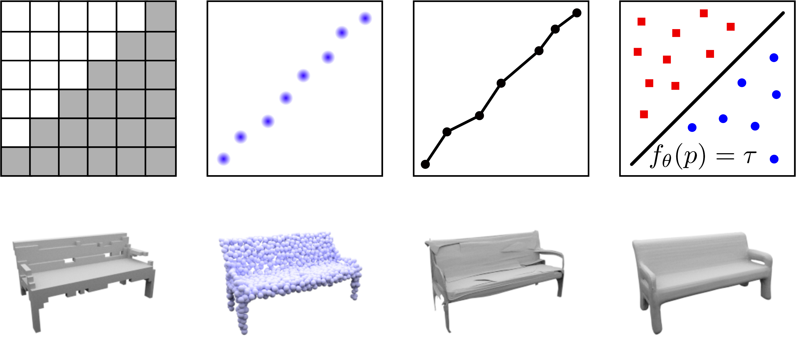

---

## SI 3D reconstruction (ShapeNet)

---

## SI 3D reconstruction (ShapeNet)

---

## SI 3D reconstruction (ShapeNet)

  

---

## SI 3D reconstruction (real world data)

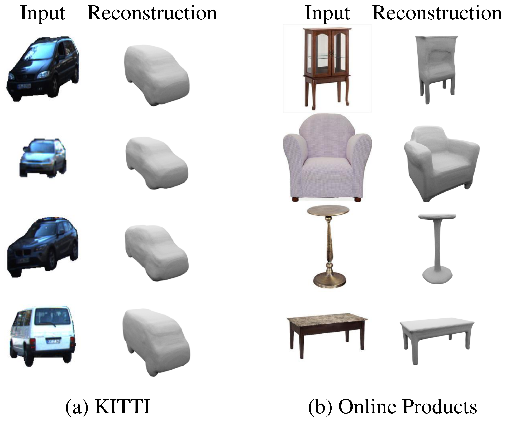

---

## Reconstruction from point clouds

  
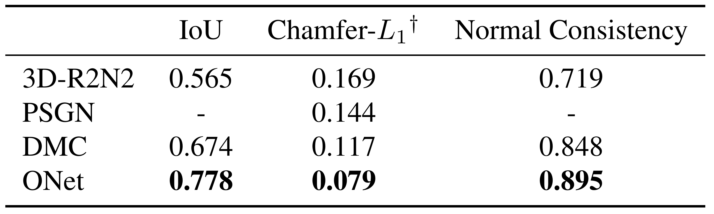

---

## Voxel super resolution

  
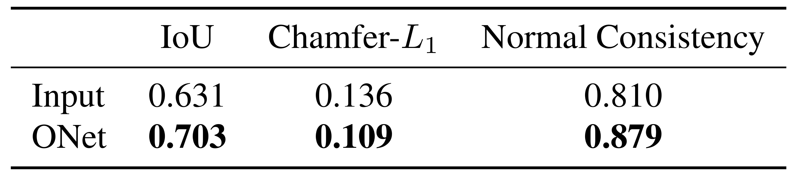
 
<b>Figure</b> Input resolution of 32^3 voxels.

---

## Unconditional 3D samples

 
<b>Figure</b> Random samples of unsupervised models trained on different categories. 

---

## Failure cases and further work

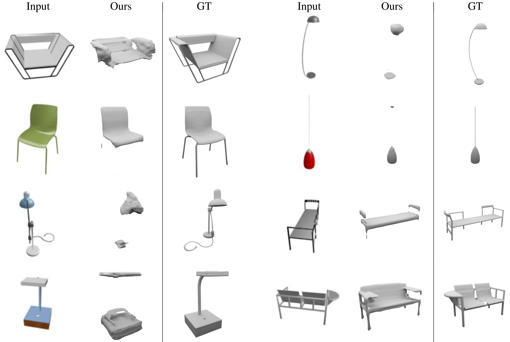

---

## Other references with similar ideas

[8]  DeepSDF: Learning Continuous Signed Distance Functions for Shape Representation, Park et al. (2019)
[9]  Learning Implicit Fields for Generative Shape Modeling, Chen et al. (2019)
[10]  Deep Level Sets: Implicit Surface Representations for 3D Shape Inference, Michalkiewicz et al. (2019)

---

## Thank you!

